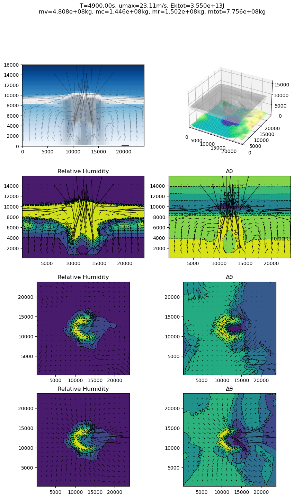
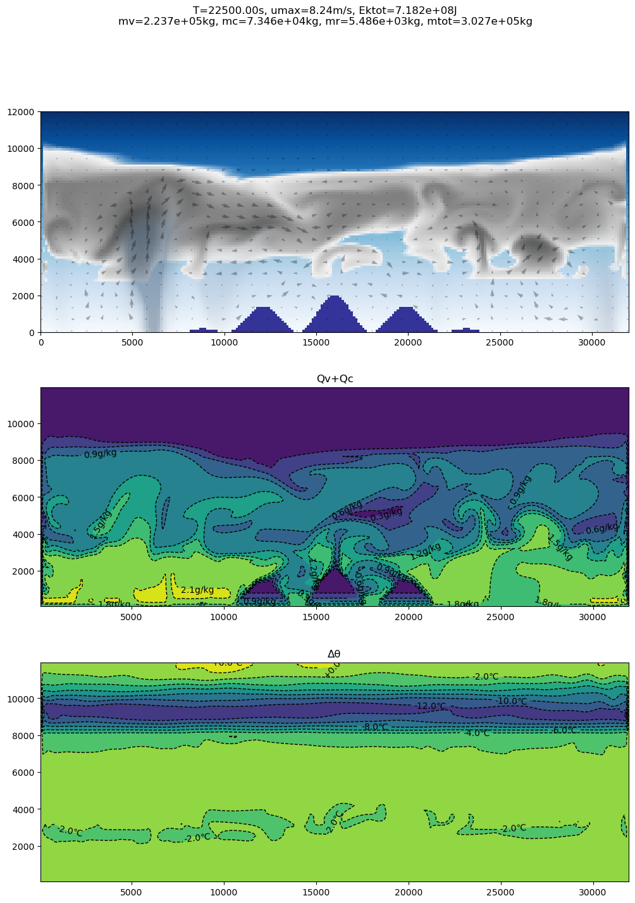

# Python Weather Simulation

## Screenshots

### A storm generated from a warm lake, 3D simulation

### Instable Atmosphere, 2D simulation

## References

<!-- - [Climate Simulation Review](https://www.geo.uni-bremen.de/~apau/ecolmas_modeling2/mcguffie_henderson_sellers_2001.pdf)

- [Iceage Simulation 1973](https://journals.ametsoc.org/view/journals/apme/13/3/1520-0450_1974_013_0305_sotacu_2_0_co_2.xml?tab_body=pdf)

- [NCAR Circulation Model 1967](https://journals.ametsoc.org/view/journals/mwre/95/7/1520-0493_1967_095_0389_nggcmo_2_3_co_2.xml?tab_body=pdf) 

- [Spherical Coordinates](https://en.wikipedia.org/wiki/Spherical_coordinate_system#Integration_and_differentiation_in_spherical_coordinates)

- [Fluid Sphere](https://www.dropbox.com/s/excugsw43c9rxjd/spherical_fluid_PACM.pdf?dl=0) 

- [NCAR Cloud](https://www.researchgate.net/publication/234292870_General_Circulation_Experiments_with_a_Six-Layer_NCAR_Model_Including_Orography_Cloudiness_and_Surface_Temperature_Calculations) -->
<!-- Those are for climate, not for weather -->

- GPU Gems 2 2D Fluid Dynamics Tutorial [Fast Fluid Dynamics Simulation on the GPU](https://developer.nvidia.com/gpugems/gpugems/part-vi-beyond-triangles/chapter-38-fast-fluid-dynamics-simulation-gpu)

- GPU Gems 3 3D Fluid Dynamics Tutorial [Real-Time Simulation and Rendering of 3D Fluids](https://developer.nvidia.com/gpugems/gpugems3/part-v-physics-simulation/chapter-30-real-time-simulation-and-rendering-3d-fluids)

- Computer Graphics Society's Apporach on Cloud/Weather Sim [Stormscapes Simulating Cloud Dynamics in the Now](http://computationalsciences.org/publications/haedrich-2020-stormscapes/haedrich-2020-stormscapes-hr.pdf) video [video link](https://dl.acm.org/doi/10.1145/3414685.3417801)

- Main Reference on Meteorologists' Cloud/Weather Sim back in 70s [The Life Cycle of a Thunderstorm in Three Dimensions](https://journals.ametsoc.org/view/journals/atsc/31/6/1520-0469_1974_031_1629_tlcoat_2_0_co_2.xml)

- Main Reference on Meteorologists' Cloud/Weather Sim back in 70s [The Pressure Perturbation and the Numerical Modeling of a Cloud](https://journals.ametsoc.org/view/journals/atsc/29/7/1520-0469_1972_029_1295_tppatn_2_0_co_2.xml)

- Main Reference on Meteorologists' Cloud/Weather Sim back in 70s [The Simulation of Three-Dimensional Convective Storm Dynamics](https://journals.ametsoc.org/view/journals/atsc/35/6/1520-0469_1978_035_1070_tsotdc_2_0_co_2.xml)

- Cloud Model [A Comparison Between Axisymmetric and Slab-Symmetric Cumulus Cloud Models](https://www.atmos.albany.edu/facstaff/rfovell/ATM562/soong-ogura-1973.pdf)

- Ceyron's Numpy Fluid Simulation Code [github](https://github.com/Ceyron/machine-learning-and-simulation/blob/main/english/simulation_scripts/stable_fluids_python_simple.py)

- Weather Simulation on Modern Supercomputer [A Violently Tornadic Supercell Thunderstorm Simulation Spanning a Quarter-Trillion Grid Volumes: Computational Challenges, I/O Framework, and Visualizations of Tornadogenesis](https://www.preprints.org/manuscript/201909.0029/v1)

